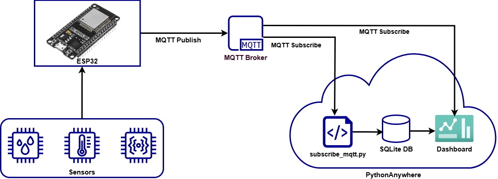

# EPG317E — Engineering Programming III
# Capstone Project

**Central University of Technology, Free State**
**Department of Electrical, Electronic and Computer Engineering**

## Overview

The EPG317E Capstone Project challenges teams to design, build, and deploy a **real-time IoT monitoring and control system** using an **ESP32 microcontroller**, **MQTT**, a **Python Panel dashboard**, **SQLite**, and **PythonAnywhere** — all managed through **GitHub** using a feature-branch workflow.

All three projects share the same technology stack and assessment structure. What differs is the physical kit and the domain (agriculture, home automation, or renewable energy).

## System Architecture

The diagram below shows how all three projects are structured at a high level. Every team follows this same data flow regardless of which project they are assigned.

**Data flow:**

1. **ESP32 firmware (C++)** reads sensors from the kit and publishes data to an MQTT broker over Wi-Fi.
2. The **MQTT broker** (free cloud tier) routes messages between the ESP32 and the dashboard.
3. The **Python Panel dashboard** subscribes to MQTT topics, stores incoming data in **SQLite**, displays live readings and historical plots, and sends control commands back to the ESP32.
4. The dashboard is **deployed on PythonAnywhere** and accessible via a public URL.
5. All code is version-controlled on **GitHub** using feature branches and pull requests.

## Team Project Assignment

There are **three capstone projects**. Each team is assigned exactly one project. The assignment is based on the physical kit your team received:

| Project | Kit | Kit Code | Domain |
|---------|-----|----------|--------|
| **Project A — IoT Smart Farm** | Keyestudio ESP32 IoT Smart Farm Kit | KS0567 | Precision agriculture |
| **Project B — IoT Smart Home** | Keyestudio Smart Home Kit (ESP32 swap) | KS0085 | Home automation |
| **Project C — IoT Solar Tracker** | Keyestudio Solar Tracking Kit (ESP32 swap) | KS0530 | Renewable energy |

Your team's assigned project file contains the full specification including kit components, sensor lists, control actions, MQTT topic structure, and project-specific notes. See:

- [Smart_Farm.md](smart-farm/Smart_Farm.md) — Project A
- [Smart_Home.md](smart-home/Smart_Home.md) — Project B
- [Smart_Solar_Tracker.md](smart-solar-tracker/Smart_Solar_Tracker.md) — Project C

## How the Projects Work

All three projects are built on the same technology pipeline:

### 1. ESP32 Firmware (Arduino IDE / C++)
The ESP32 reads sensors at a regular interval (every 5–10 seconds), publishes data to structured MQTT topics, and subscribes to control topics to execute commands sent from the dashboard.

### 2. MQTT Communication
Teams choose a free MQTT broker (HiveMQ Cloud, EMQX Cloud, or Mosquitto test broker). Topics follow a structured naming convention specific to each project domain (`farm`, `home`, or `solar`).

### 3. Python Dashboard (Panel / HoloViz)
A web dashboard built with [Panel](https://panel.holoviz.org/) provides:
- **Live data display** — real-time sensor readings and actuator status
- **Historical plots** — time-series charts over selectable ranges (1h, 6h, 24h, 7d)
- **Control panel** — buttons, toggles, and sliders to send commands back to the ESP32

### 4. Database (SQLite)
All incoming sensor data is stored with timestamps in a SQLite database. The dashboard queries this database for historical views.

### 5. Deployment (PythonAnywhere)
The dashboard is deployed on PythonAnywhere (free tier) and must be accessible via a public URL during assessment.

### 6. GitHub Workflow
Teams use a **feature branch + pull request** workflow:
- `main` always contains working, tested code
- Each feature or fix is developed on a named branch (e.g., `feature/mqtt-connection`)
- Pull requests require review and approval from at least one other team member before merging
- **Individual marks are based on pull request contributions** — every member must have at least 3 meaningful PRs

---

## Assessment (100 Marks Total)

The rubrics below apply to **all three projects**. Project-specific notes are indicated where relevant.

### Component Breakdown

| Component | Weight | Marks |
|-----------|--------|-------|
| Code (GitHub) | 30% | 30 |
| Dashboard Design & Functionality | 40% | 40 |
| Presentation & Demo | 30% | 30 |
| **Total** | **100%** | **100** |

## Common Resources

### Software Downloads
- **Arduino IDE:** [https://www.arduino.cc/en/software](https://www.arduino.cc/en/software)
- **ESP32 Arduino Core Installation:** [https://docs.espressif.com/projects/arduino-esp32/en/latest/installing.html](https://docs.espressif.com/projects/arduino-esp32/en/latest/installing.html)
- **Python (3.10+):** [https://www.python.org/downloads/](https://www.python.org/downloads/)
- **Git:** [https://git-scm.com/downloads](https://git-scm.com/downloads)

### Documentation
- **Panel (HoloViz):** [https://panel.holoviz.org/](https://panel.holoviz.org/)
- **Paho MQTT (Python):** [https://pypi.org/project/paho-mqtt/](https://pypi.org/project/paho-mqtt/)
- **PubSubClient (ESP32 Arduino MQTT):** [https://github.com/knolleary/pubsubclient](https://github.com/knolleary/pubsubclient)
- **SQLite with Python:** [https://docs.python.org/3/library/sqlite3.html](https://docs.python.org/3/library/sqlite3.html)
- **PythonAnywhere:** [https://www.pythonanywhere.com/](https://www.pythonanywhere.com/)
- **GitHub Docs — Pull Requests:** [https://docs.github.com/en/pull-requests](https://docs.github.com/en/pull-requests)

### MQTT Brokers (Free Tier)
- **HiveMQ Cloud:** [https://www.hivemq.com/mqtt-cloud-broker/](https://www.hivemq.com/mqtt-cloud-broker/)
- **EMQX Cloud:** [https://www.emqx.com/en/cloud](https://www.emqx.com/en/cloud)
- **Mosquitto Test Broker:** [https://test.mosquitto.org/](https://test.mosquitto.org/)

## Important Notes

- **Team Size:** 5–6 students per team (existing groups).
- **Submission:** All deliverables (code, portfolio, presentation slides) must be submitted via the LMS. Check the LMS for submission dates and detailed instructions.
- **Academic Integrity:** All work must be original. Code copied from external sources must be attributed. Plagiarism in the portfolio will result in disciplinary action.
- **Late Submissions:** Refer to the LMS for the late submission policy.
- **Hardware Care:** Handle all kit components with care. You are responsible for the condition of the kit. Follow any project-specific hardware warnings in your assigned project file.

*EPG317E — Engineering Programming III | Central University of Technology, Free State*
